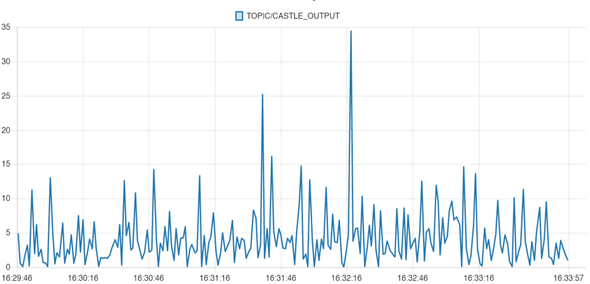
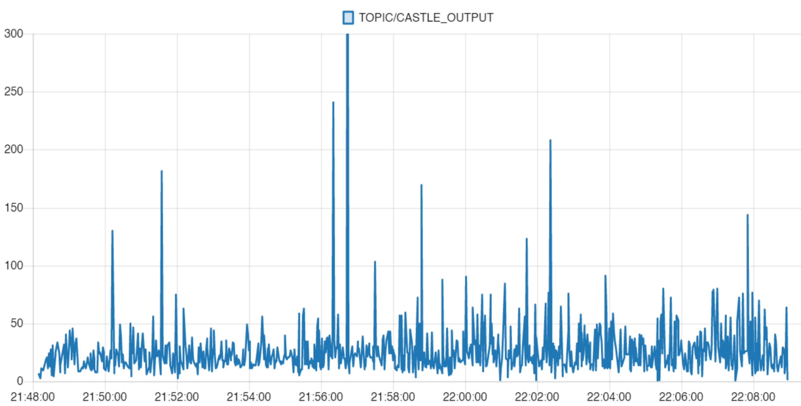
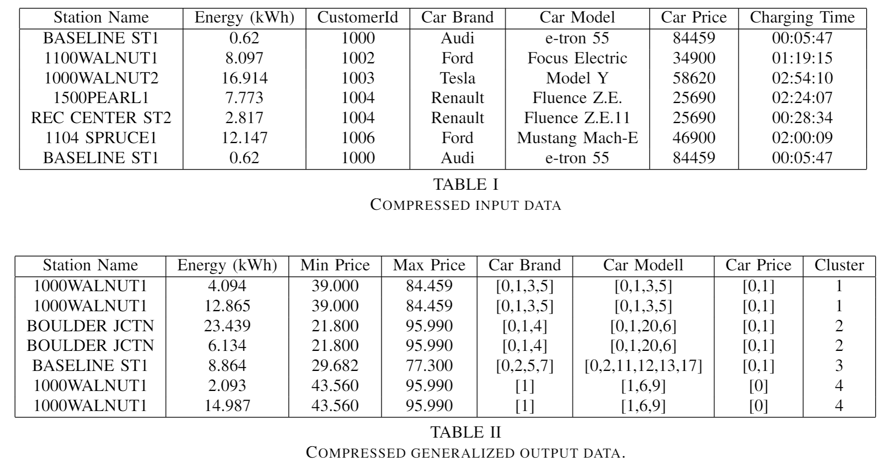

 


# RedCASTLE
### k-Anonymity for Streaming Data in Node-RED

## Summary
This is a project done during the Summer Semester 2021 at the Technical University Berlin in the module Privacy Engineering. 
The goal was to implement privacy related features in an actual use case to provide value for others in the future. In this project k-Anonymity for streaming data is implemented in the Node-Red environment. 

This repository is based on [CASTLEGUARD](https://github.com/hallnath1/CASTLEGUARD), which implements the [CASTLE (Continuously Anonymizing STreaming data via adaptive cLustEring)](https://ieeexplore.ieee.org/abstract/document/5374415) algorithm by J. Cao, B. Carminati, E. Ferrari and K. Tan. 


## Contributions
The CASTLEGUARD algorithm has been extended by several features:
* Integrated streaming interface for input and output data based on MQTT
* Support for non-numerical data through automatic conversion
* No constraints regarding the number of senders
* High Configurability
* Multiple deployment options

## How to run it

There are three possible options for running the system:
1. **Manually:** Install all needed dependencies and start it locally
2. **Docker:** Build a Docker image from the `DOCKERFILE` or use the pre-configured docker image from DockerHub
3. **Cloud deployment:** Deploy and provision the code on a Cloud VM with TerraForm

### Manual
To run the project you need to install these dependencies:
* Node-Red
* MQTT Mosquitto
* Python (>= 3.6)
* pandas, numpy, paho-mqtt, matplotlib

The required Python packages can be installed automatically with `pip install -r requirements.txt`.
To pass and retrieve data from the component, you need to specify the host and port of your MQTT server in the `config.json` or use the default configuration on `localhost:1883`.

For starting both Mosquitto and Node-Red you can simple execute the `setup.sh` script *(macOS & Linux only)*
You can access Node-RED on `localhost:1880`.
In order to inject external data in 

### Docker
The example setup can also be run using Docker. Simply build a Docker image from the `DOCKERFILE` or pull the latest Docker image from [Docker Hub](https://hub.docker.com/r/niklasamslgruber/node-red-castle).

Alternatively, you can run the Docker image with `docker run -ti -p 1883:1883 -p 1880:1880 niklasamslgruber/node-red-castle` and navigate to `localhost:1880` to see Node-RED.


### Cloud Deployment
We prepared a Terrafrom deployment to easily deploy RedCASTLE in the cloud. 
1. You need to install Terraform and the [GCloud SDK](https://cloud.google.com/sdk/docs/quickstart). 
2. Configure GCloud with `gcloud init` and set it as the default login mechanism `gcloud auth application-default login`
3. Then run ones `terraform init` in the root directory of this repository.
4. Afterwards you can start the deployment with `terraform apply`.

To cleanup you need to run `terraform destroy`.

## How to configure
You can modify the default configuration by adjusting the `config.json` file in `CASTLE/src/config.json`. The config file should be kept in the `src` directory. The config.json file is split into two parts (`params` and `io`). 

### `params`
* `k`: Value for k-anonymity
* `delta`: Maximum number of tuples
* `beta`: Number of non-k-anonymized clusters in memory
* `mu`: Threshold for deciding whether to push a new datapoint into an existing cluster or create a new one
* `seed`: Random seed *(optional)*
* `sensitive_attribute`: The sensitive attribute used for the k-anonymity
* `quasi_identifiers`: All identifiers which should be generalized
* `non_categorized_columns`: All columns which should be automatically transformed into numerical categories (required for all columns with string values)
* `pid_column`: Name of the column with a unique identifier
* `history`: Whether CASTLE should record all input tuples *(optional)*

### `io`
* `host`: Host of your MQTT server (default: localhost) *(optional)*
* `port`: Port of your MQTT server (localhost: 1883) *(optional)*
* `mqtt_topics_in`: All MQTT topics the system should subscribe on 
* `mqtt_topic_out`: The topic to publish the output data on

## How to use
When starting the project over one of the three ways shown above, you should be able to access the Node-RED web ui under `<ip-address>:1880`, the Node-Red dashboard under `<ip-address>:1880/ui` and the mqtt broker via `<ip-address>:1883`.

### Quickstart
To run our validation test scenario browse to `<ip-address>:1880/ui` and press the button "start simulation and castleguard".

### Use your own data
1. change the `CASTLE/src/config.json` accordingly to your data. 
2. click the "manual start" node in the ks-Anonymization tab of Node-REDs web ui.
3. Send your data to the mqtt broker `<ip-address>:1883`
4. now the anonymized data should be written to the file anonymized_tuples.csv

### Overview
When accessing the Node-RED web ui at `<ip-address>:1880` you should see the nodes and relations of the current flow. There are 5 flows represented by the tabs at the top: *ks-Anonymization, Charging Station Emulator, Statistics, Filtering, Dashboard entrypoint*.

*ks-Anonymization* and *Charging Station Emulator* are the core flows that will run in parallel. The *Charging Station Emulator* flow finish by publish to the MQTT broker and *ks-Anonymization* is triggers by receive a message from the MQTT subscriber node. *Statistics* is always called as one of the final steps of *ks-Anonymization* to generate statistics shown in the Node-RED Dashboard (`<ip-address>:1880/ui`). There are implemented subflows to manipulate data, that can also be found in the node selection of the left side. These manipulations are currently used during the generation of you test data and in the normal executing process at the end of *ks-Anonymization* when the flow *Filtering* is called. See section Data manipulation for further information how to use this.

Data send to the MQTT broker have to be in JSON format. In order to deal with this data, you need to make changes to `CASTLE/src/config.json`. The `sensitive_attribute`, `quasi_identifiers` and `non_categorized_columns` have to be changed in respond to the data you expect to be sent to the MQTT broker. Without these changes, the chances are high that the Castleguard backend will immediately crash when unknown data arrives. A Castleguard crash can be detected by having a look at the *"run CASTLEGUARD"* node in the *ks-Anonymization* flow. When this node is running correctly, it should show a blue dot with `pid: <number>`. `rc: <number>` means the background process has crashed. For further debugging purposes you could also simply run CASTLEGUARD in a command line and stop Node-RED von starting it by deleting ingoing lines to the *"run CASTLEGUARD"* node.

## Performance Impact

Depending on the used machine and the throughput rate you have to expect **multiple seconds to minutes** overhead.

Higher throughput lowers the added delay. [sic] This is because the algorithm needs to collect a specific amount of data to achieve the set privacy constraint. With lower throughput the data have to sit longer inside the algorithms clusters to wait until they can get released.

## Benchmarks
We performed some benchmarks on a n2-standard-2 GCloud Compute Engine with 2 vCPUs and 8 GB RAM.



**Throughput:** 40 messages per second were sent and processed.



**Throughput:** 8 messages per second were sent and processed.

Note the differences in the axis scale.

On the n2-standard-2 GCloud Compute Engine with 2 vCPUs and 8 GB RAM we achieved a maximum of 45 messages per second. Further research showed, that without the use of the modified CASTLEGUARD algorithm, Node-Red and Mosquitto can deal with 95 MQTT messages per second but slowly trends towards 45 msg/s when the message queue fills up. Without the use of a message queue or broker and without the modified CASTLEGUARD algorithm, we where able to measure a constant throughput of 195 messages per second. 

These findings indicate that the used message broker may be a possible bottleneck in the current implementation state.

The benchmark images are screenshots from the integrated Node-RED dashboard. (accessible under `<ip-address>:1880/ui`)

## Example Dataset

The used validation use case is a dataset with electric vehicle charging data. The data used is provided by the city of Boulder in Colorado (USA) via their [Open Data Plattform](https://open-data.bouldercolorado.gov/datasets/4368ba17948c459c813734bd78b3a355_0) in a CC0 1.0 Public Domain Dedication license model. To spice up the dataset, a number of fake persons with specific vehicle models and unique ids are generated and used to enrich the original dataset.
| Station Name           | Address          | Zip/Postal Code | Start Date & Time | End Date & Time | Total Duration (hh:mm:ss) | Charging Time (hh:mm:ss) | Energy (kWh) | GHG Savings (kg) | Gasoline Savings (gallons) | customer id | allow dynamic charging | car brand | car model |
|------------------------|------------------|-----------------|-------------------|-----------------|---------------------------|--------------------------|--------------|------------------|----------------------------|-------------|------------------------|-----------|------------|
| BOULDER / JUNCTION ST1 | 2280 Junction Pl | 80301           | 1/1/2018 17:49    | 1/1/2018 19:52  | 2:03:02                   | 2:02:44                  | 6.504        | 2.732            | 0.816                      | 1006        | true                   | Tesla     | Model Y    |
| BOULDER / JUNCTION ST1 | 2280 Junction Pl | 80301           | 1/2/2018 8:52     | 1/2/2018 9:16   | 0:24:34                   | 0:24:19                  | 2.481        | 1.042            | 0.311                      | 1052        | true                   | BMW       | i3         |


## What output you can expect
These are just a compressed version of the Data above to show what transformations are made during the k-anonymization process.

The list of ids, for example for *Car Brand* can be mapped back to the corresponding strings via the generated `mapping.json`.


## Data manipulation

Additionally a few functionalities were added to assist further to achieve privacy when working with personal data. Fro this a filter, reduce and a change function are implemented.

These functions can be configured via a json object. This configuration object has to be added to the message object, not the msg.payload object.

Example configurations for filter, reduce and changes:
--------
Suppressed specific properties:
```json
{
    "suppressed_properties": [
        "ObjectId",
        "Address",
        "City"
    ]
}
```
message object structure for this example: msg.suppressed_properties.suppressed_properties (array[3])


Filter for specific conditions. Currently supported are range filtering as well as whitelist and blacklist filtering. A entry has to pass all filter conditions, otherwise the entry is removed from the set. You could also use only one or two of the filter conditions.
```json
{
    "filterCondition": {
        "rangeFilter": {
            "columnName": "ObjectId",
            "minValue": 10000,
            "maxValue": 30000
        },
        "whitelistFilter": {
            "columnName": "ObjectId",
            "whitelistValues": [
                10459,
                22794,
                20286,
                872
            ]
        },
        "blacklistFilter": {
            "columnName": "ObjectId",
            "blacklistValues": [
                22794
            ]
        }
    }
}
```
message object structure for this example: msg.filterCondition.rangeFilter (object) ...

Change or append new properties based on existing properties. 

Add a car_price property based on a given mapping of car_model names and prices.
```json
{
    "changeStringEqual": {
        "sourceAttributeName": "car_modell",
        "changeAttributeName": "car_price",
        "change": [
            {
                "conditionStringEqual": "e-tron 55",
                "valueForChangeAttributeName": 84459
            },
            {
                "conditionStringEqual": "e-tron 50",
                "valueForChangeAttributeName": 69100
            }
        ]
    }
}
```
message object structure for this example: msg.changeConditions.changeStringEqual (object)

Add a alternative way to interpret the car prices by adding car_price_alt which sets different values depending on if the car_price is in a specific range.
```json
{
    "changeRangeBased": {
        "sourceAttributeName": "car_price",
        "changeAttributeName": "car_price_alt",
        "change": [
            {
                "conditionMin": 40000,
                "conditionMax": 120000,
                "valueForChangeAttributeName": "expensive"
            },
            {
                "conditionMin": 0,
                "conditionMax": 39999,
                "valueForChangeAttributeName": "cheap"
            }
        ]
    }
}
```
message object structure for this example: msg.changeConditions.changeRangeBased (object)