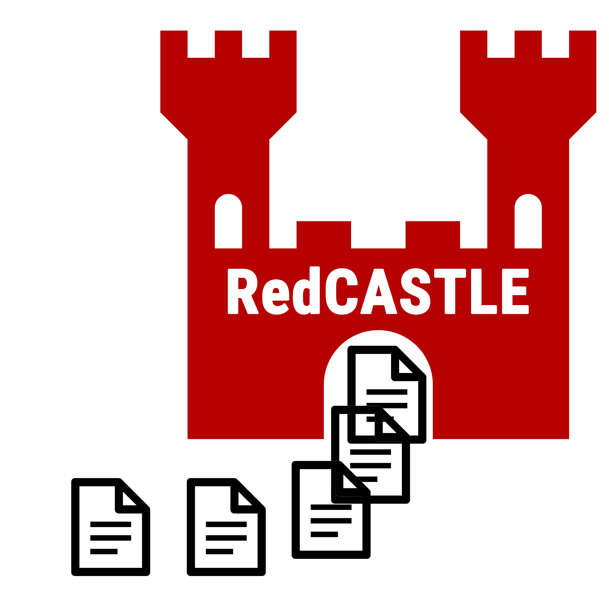

<center>  </center>


# RedCASTLE - k-Anonymity for Streaming Data in Node-RED

## Summary
This is a project work done during the Summer Semester 2021 at the Technical University Berlin in the module Privacy Engineering. The goal is to implement privacy related features in an actual use case to provide value for others in the future. In this project k-Anonymity is implemented in a streaming data use case in the Node-Red environment. 

This work is based on [CASTLEGUARD](https://github.com/hallnath1/CASTLEGUARD), which based on the [CASTLE (Continuously Anonymizing STreaming data via adaptive cLustEring)](https://ieeexplore.ieee.org/abstract/document/5374415) by J. Cao, B. Carminati, E. Ferrari and K. Tan. 
The CASTLEGUARD algorithm has been modified to work with MQTT for input and output data as well as several other modification options.

# How to run it

We have prepared three different ways to run this.
1. manual, installing all needed dependencies and start it locally
2. docker, use a pre-configured docker image
3. cloud deployment, deploy and provision a cloud vm

## Manual
To run the project you need to install these dependencies:
* Node-Red
* MQTT Mosquitto
* Python (>= 3.6)
* pandas, numpy, paho-mqtt, matplotlib

The required Python packages can be installed automatically with `pip install -r requirements.txt`.
To pass and retrieve data from the component, you need to specify the host and port of your MQTT server in the `config.json` or use the default configuration on `localhost:1883`.

For starting both Mosquitto and Node-Red you can simple execute the `setup.sh` script *(macOS & Linux only)*
You can access Node-RED on `localhost:1880`.
In order to inject external data in 

## Docker
The example setup can also be run using Docker. Simply build a Docker image from the `DOCKERFILE` or pull the latest Docker image from [Docker Hub](https://hub.docker.com/r/niklasamslgruber/node-red-castle).

Alternatively, you can run the Docker image with `docker run -ti -p 1883:1883 -p 1880:1880 niklasamslgruber/node-red-castle` and navigate to `localhost:1880` to see Node-RED.


## Cloud Deployment
We prepared a Terrafrom deployment to easily deploy RedCASTLE in the cloud. 
1. You need to install Terraform and the [GCloud SDK](https://cloud.google.com/sdk/docs/quickstart). 
2. Configure GCloud with `gcloud init` and set it as the default login mechanism `gcloud auth application-default login`
3. Then run ones `terraform init` in the root directory of this repository.
4. Afterwards you can start the deployment with `terraform apply`.

To cleanup you need to run `terraform destroy`.

# How to configure
You can modify the default configuration by adjusting the `config.json` file in `CASTLE/src/config.json`. The config file should be kept in the `src` directory. The config.json file is split into two parts (`params` and `io`). 

## `params`
* `k`: Value for k-anonymity
* `delta`: 
* `beta`: Number of non-k-anonymized clusters in memory
* `mu`: Threshold for deciding whether to push a new datapoint into an existing cluster or create a new one
* `seed`: Random seed *(optional)*
* `sensitive_attribute`: The sensitive attribute used for the k-anonymity
* `quasi_identifiers`: All identifiers which should be generalized
* `non_categorized_columns`: All columns which should be automatically transformed into numerical categories (required for all columns with string values)
* `pid_column`: Name of the column with a unique identifier
* `history`: Whether CASTLE should record all input tuples *(optional)*

## `io`
* `host`: Host of your MQTT server (default: localhost) *(optional)*
* `port`: Port of your MQTT server (localhost: 1883) *(optional)*
* `mqtt_topics_in`: All MQTT topics the system should subscribe on 
* `mqtt_topic_out`: The topic to publish the output data

# Example Dataset

The used validation use case is a dataset with electric vehicle charging data. The data used is provided by the city of Boulder in Colorado (USA) via their [Open Data Plattform](https://open-data.bouldercolorado.gov/datasets/4368ba17948c459c813734bd78b3a355_0) in a CC0 1.0 Public Domain Dedication licence model. To spice up the dataset, a number of fake persons with specific vehicle models and unique ids are generated and used to enrich the original dataset.
| Station Name           | Address          | Zip/Postal Code | Start Date & Time | End Date & Time | Total Duration (hh:mm:ss) | Charging Time (hh:mm:ss) | Energy (kWh) | GHG Savings (kg) | Gasoline Savings (gallons) | customer id | allow dynamic charging | car brand | car modell |
|------------------------|------------------|-----------------|-------------------|-----------------|---------------------------|--------------------------|--------------|------------------|----------------------------|-------------|------------------------|-----------|------------|
| BOULDER / JUNCTION ST1 | 2280 Junction Pl | 80301           | 1/1/2018 17:49    | 1/1/2018 19:52  | 2:03:02                   | 2:02:44                  | 6.504        | 2.732            | 0.816                      | 1006        | true                   | Tesla     | Model Y    |
| BOULDER / JUNCTION ST1 | 2280 Junction Pl | 80301           | 1/2/2018 8:52     | 1/2/2018 9:16   | 0:24:34                   | 0:24:19                  | 2.481        | 1.042            | 0.311                      | 1052        | true                   | BMW       | i3         |

# Data manipulation

Additionally a few functionalities were added to assist further to achieve privacy when working with personal data. Fro this a filter, reduce and a change function are implemented.

These functions can be configured via a json object. This configuration object has to be added to the message object, not the msg.payload object.

Example configurations for filter, reduce and changes:
--------
Suppressed specific properties:
```json
{
    "suppressed_properties": [
        "ObjectId",
        "Address",
        "City"
    ]
}
```
message object structure for this example: msg.suppressed_properties.suppressed_properties (array[3])


Filter for specfic conditions. Currenty supported are range filtering as well as whitelist and blacklist filtering. A entry has to pass all filter conditions, otherwise the entry is removed from the set. You could also use only one or two of the filter conditions.
```json
{
    "filterCondition": {
        "rangeFilter": {
            "columnName": "ObjectId",
            "minValue": 10000,
            "maxValue": 30000
        },
        "whitelistFilter": {
            "columnName": "ObjectId",
            "whitelistValues": [
                10459,
                22794,
                20286,
                872
            ]
        },
        "blacklistFilter": {
            "columnName": "ObjectId",
            "blacklistValues": [
                22794
            ]
        }
    }
}
```
message object structure for this example: msg.filterCondition.rangeFilter (object) ...

Change or append new properties based on existing properties. 

Add a car_price property based on a given mapping of car_modell names and prices.
```json
{
    "changeStringEqual": {
        "sourceAttributeName": "car_modell",
        "changeAttributeName": "car_price",
        "change": [
            {
                "conditionStringEqual": "e-tron 55",
                "valueForChangeAttributeName": 84459
            },
            {
                "conditionStringEqual": "e-tron 50",
                "valueForChangeAttributeName": 69100
            }
        ]
    }
}
```
message object structure for this example: msg.changeConditions.changeStringEqual (object)

Add a alternative way to interpret the car prices by adding car_price_alt which sets different values depending on if the car_price is in a specific range.
```json
{
    "changeRangeBased": {
        "sourceAttributeName": "car_price",
        "changeAttributeName": "car_price_alt",
        "change": [
            {
                "conditionMin": 40000,
                "conditionMax": 120000,
                "valueForChangeAttributeName": "expensive"
            },
            {
                "conditionMin": 0,
                "conditionMax": 39999,
                "valueForChangeAttributeName": "cheap"
            }
        ]
    }
}
```
message object structure for this example: msg.changeConditions.changeRangeBased (object)